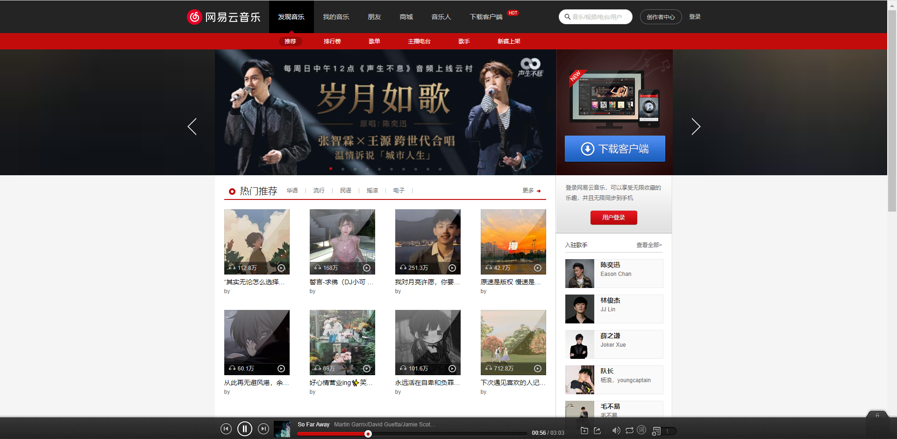
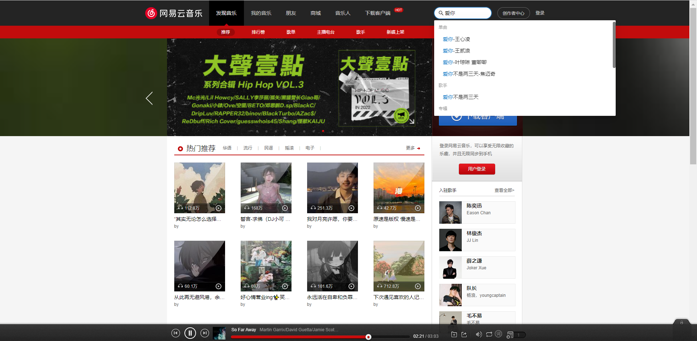
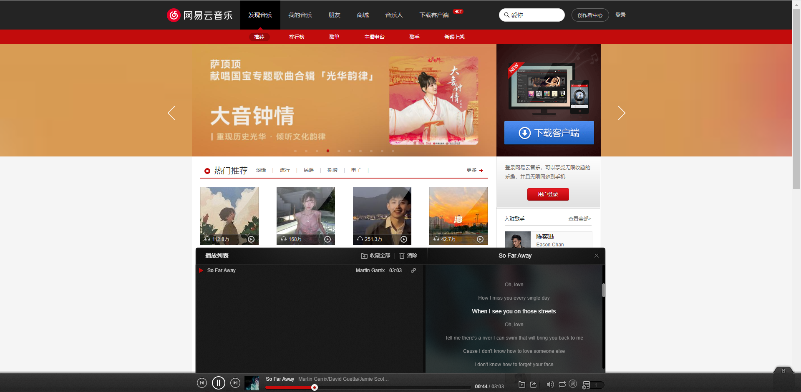
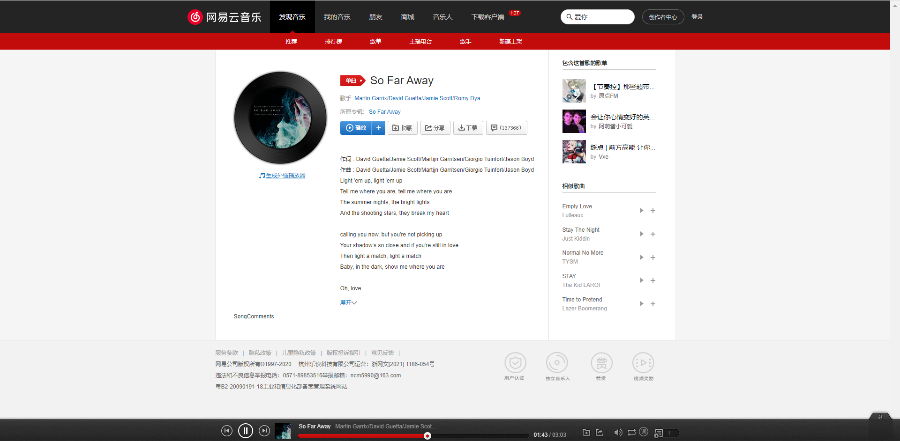

# 云音乐网站
基于React v18 + React-router v6 + style_components 等技术开发的web端音乐项目
## 项目启动
```
yarn install 
yarn start
```
## 项目说明

### 搜索建议

### 播放列表

### 歌曲详情

## 技术栈
### 前端
- `React`：^18.0.0
- `styled-components`：^18.0.0
- `axios`: "^0.27.0"
- `react-router-dom`：^6.3.0
- `redux`：React 集中状态管理，在多个组件共享某些状态时非常方便
- `react-redux`：帮助我们链及redux、react的辅助工具
- `immutable`：^4.0.0
- `redux-immutable`: ^4.0.0
- `redux-thunk`: ^2.4.1
- `react-transition-group`: ^4.4.2
### 后端
https://binaryify.github.io/NeteaseCloudMusicApi `Version:4.5.14`
